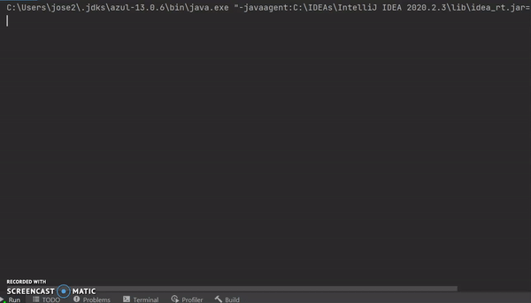

# WordSuggestionEngine

The program reads in sample text messages and counts how many times that a pair combo occurs. The program suggests the next word to be used based on the popularity of a word used after the last word. If there is no popular word to be suggested the program defaults to suggestions: “the”, “this”, and “of”.  
Concepts used: 
* Bigram
* Affinity Analysis

## Demonstration
This a demo of the current capabilities of the program as of November 25, 2019.   
 
